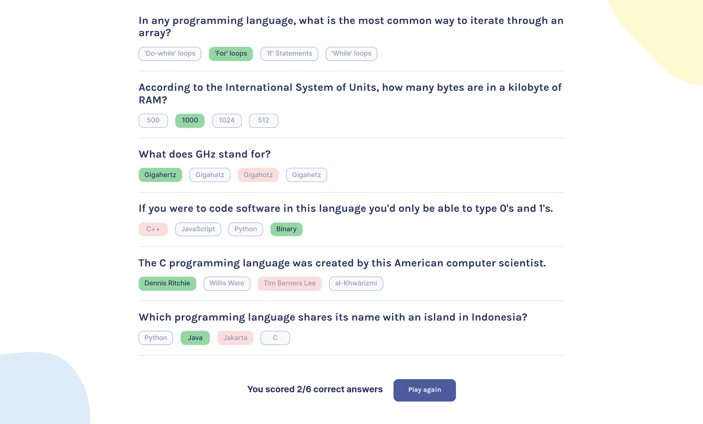

# Scrimba, Learn React - Quizzical Solo Project
Quizzical is a 100% solo project that is an optional challenge at the end of the [Learn React](https://scrimba.com/learn/learnreact) course at Scrimba. Some of the main project features are listed below.

| Feature         | Description                                                            |
| :-------------- | :--------------------------------------------------------------------- |
| API data        | Fetch and decode quiz data from an API                                 |
| Random quizzes  | Get always different question with shuffled answers                    |
| Save answers    | Save the selected answers in state                                     |
| Quiz evaluation | Count correct answers and apply modifier classes for visual evaluation |

Preview: 

Live URL: [Solution](https://quizzical-solution.netlify.app/)